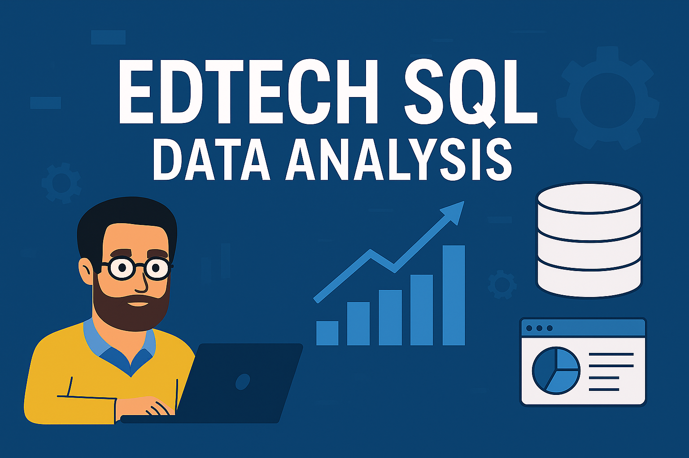
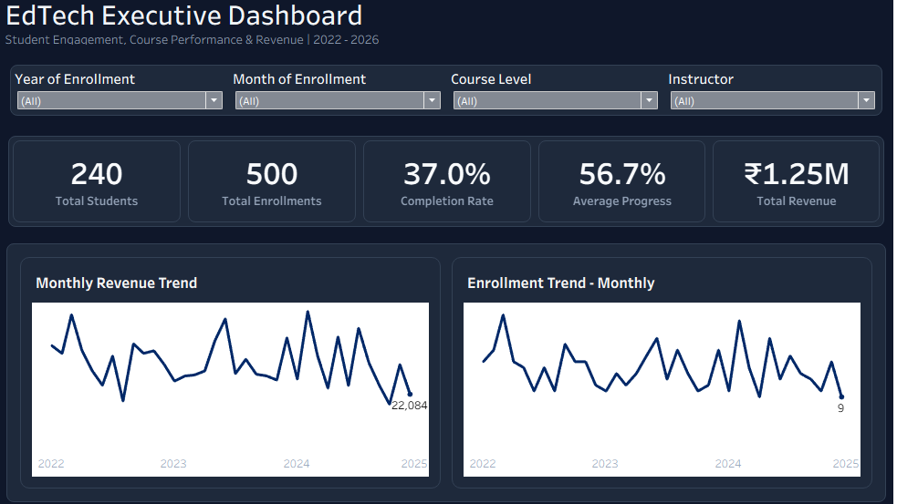

# 🎓 EdTech SQL Data Analysis

  

  <strong>End-to-end SQL analytics project for an EdTech platform</strong>

  ---

## 📌 Project Overview

This project is an end-to-end analysis of an EdTech platform covering students, courses, instructors, and enrollments.

The project combines Microsoft SQL Server and Tableau to transform
raw enrollment data into business-focused insights around:

- Student enrollment and engagement
- Course performance
- Revenue trends and category performance
- Instructor performance
- Course completion
- Business opportunities and recommendations

The goal is to demonstrate a complete analytics workflow from
data preparation and validation to SQL analysis, business questions,
and interactive dashboard reporting.

---

## 🛠️ Tech Stack

| Tool | Purpose |
|---|---|
| **Microsoft SQL Server** | Database management and analytical SQL |
| **SQL** | Data validation, transformation, analysis and business questions |
| **Tableau** | Interactive dashboards and data visualization |
| **GitHub** | Version control and project documentation |

---

## 🧠 Dataset Overview

The project contains four primary entities:

### 1️⃣ Students

| Column | Description |
|---|---|
| `student_id` | Unique student identifier |
| `first_name`, `last_name` | Student name |
| `gender` | Male / Female / Other |
| `date_of_birth` | Student's birth date |
| `email` | Contact email |
| `city` | City of registration |
| `registration_date` | Date student registered |

### 2️⃣ Instructors

| Column | Description |
|---|---|
| `instructor_id` | Unique instructor identifier |
| `instructor_name` | Instructor full name |
| `specialization` | Area of expertise |
| `experience_years` | Teaching experience in years |

### 3️⃣ Courses

| Column | Description |
|---|---|
| `course_id` | Unique course identifier |
| `course_name` | Course title |
| `category` | Course domain |
| `course_level` | Beginner / Intermediate / Advanced |
| `price` | Course price in INR |
| `published_date` | Course publication date |
| `instructor_id` | Foreign key → `instructors.instructor_id` |

### 4️⃣ Enrollments

| Column | Description |
|---|---|
| `enrollment_id` | Unique enrollment identifier |
| `student_id` | Foreign key → `students.student_id` |
| `course_id` | Foreign key → `courses.course_id` |
| `enrollment_date` | Enrollment date |
| `progress_percent` | Course progress percentage (0–100%) |

For detailed column definitions and business meanings, see [Data Dictionary Docs](https://github.com/shahbazanalytics/edtech-sql-data-analysis/blob/main/docs/data_dictionary.md).

The database relationships are documented in database_schema.md and visualized in [ER Diagram](https://github.com/shahbazanalytics/edtech-sql-data-analysis/blob/main/er_diagram.png).

---

## 📊 Dashboard

### EdTech Executive Analytics Dashboard

The Tableau dashboard provides an executive-level view of:

- Total students
- Total enrollments
- Completion rate
- Average progress
- Revenue
- Monthly revenue trends
- Monthly enrollment trends
- Revenue by category
- Revenue by instructor
- Top 5 courses by revenue
- High-completion courses
- Instructor performance

## 📊 Dashboard Preview

  

### 🔗 Interactive Dashboard

**[View the dashboard on Tableau Public](https://public.tableau.com/app/profile/mohammad.shahbaz.alam7315/viz/Edtech_Analysis_Dashboard/EdTechExecutiveDashboard)**

---

🧠 Business Questions

The SQL analysis is structured around practical business questions, including:

 - How are enrollments changing over time?
 - Which course categories generate the most revenue?
 - Which courses attract the most students?
 - Which instructors generate the highest revenue?
 - Which courses have stronger completion rates?
 - Where is learner engagement relatively low?
 - How does course level relate to enrollment and completion?
 - Which areas of the platform could benefit from further attention?

---

💡  Business Recommendations

#### The analysis produces recommendations around:

 - Improving engagement in lower-performing courses
 - Identifying high-performing course categories
 - Understanding instructor-level performance
 - Monitoring enrollment and revenue trends
 - Improving completion performance
 - Using learner progress to identify potential engagement issues

Detailed recommendations are available in [Business Recommendations Docs](https://github.com/shahbazanalytics/edtech-sql-data-analysis/blob/main/docs/business_recommendations.md).

---

🎯 Project Goal

The project demonstrates how SQL and visualization tools can be combined to move from raw operational data to actionable business insights.

Data → SQL Database → Validation → Analysis → Business Questions → Insights → Tableau Dashboard
