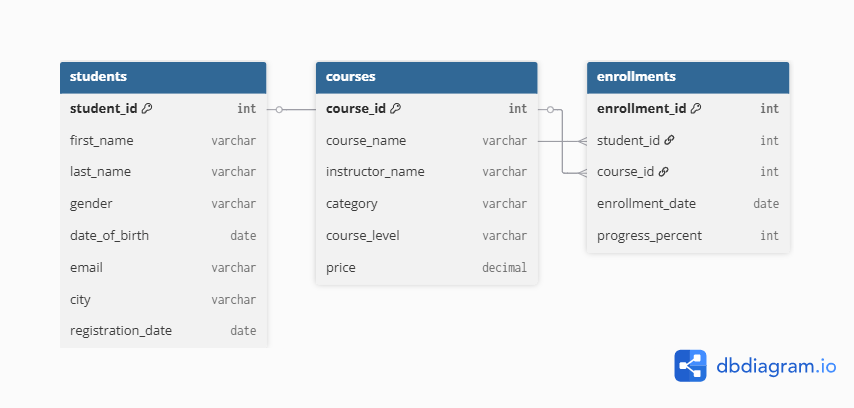

# 🧾 Database Schema — EdTech SQL Project

This document describes the database schema used in the **EdTech Data Analysis** project.

---

## 1️⃣ students

| Column Name        | Data Type     | Description                                 |
|--------------------|---------------|---------------------------------------------|
| student_id         | INT (PK)      | Unique student identifier                   |
| first_name         | VARCHAR(50)   | First name of the student                   |
| last_name          | VARCHAR(50)   | Last name of the student                    |
| gender             | VARCHAR(10)   | Gender (Male/Female/Other)                  |
| date_of_birth      | DATE          | Student’s date of birth                     |
| email              | VARCHAR(100)  | Contact email                               |
| city               | VARCHAR(50)   | City of registration                        |
| registration_date  | DATE          | Date student registered on the platform     |

---

## 2️⃣ courses

| Column Name      | Data Type     | Description                                 |
|------------------|---------------|---------------------------------------------|
| course_id        | INT (PK)      | Unique course identifier                    |
| course_name      | VARCHAR(100)  | Course title                                |
| instructor_name  | VARCHAR(100)  | Instructor teaching the course              |
| category         | VARCHAR(50)   | Category or domain (e.g., Python, Web Dev)  |
| course_level     | VARCHAR(20)   | Level (Beginner/Intermediate/Advanced)      |
| price            | DECIMAL(10,2) | Course price in INR                         |

---

## 3️⃣ enrollments

| Column Name       | Data Type     | Description                                 |
|-------------------|---------------|---------------------------------------------|
| enrollment_id     | INT (PK)      | Unique enrollment identifier                |
| student_id        | INT (FK)      | References students(student_id)             |
| course_id         | INT (FK)      | References courses(course_id)               |
| enrollment_date   | DATE          | When the student enrolled                   |
| progress_percent  | INT           | Course completion percentage (0–100)        |

---

## 🔗 Relationships

| Relationship | Type | Description |
|---------------|------|-------------|
| students → enrollments | 1-to-many | Each student can have multiple enrollments |
| courses → enrollments  | 1-to-many | Each course can have multiple enrollments |

---

## 🧠 Notes
- The schema is designed for **Microsoft SQL Server**.
- It contains **synthetic data** (300 students, 20 courses, 500 enrollments).
- Use this schema for learning **SQL analysis**.
- No sensitive or real data is included.

---

